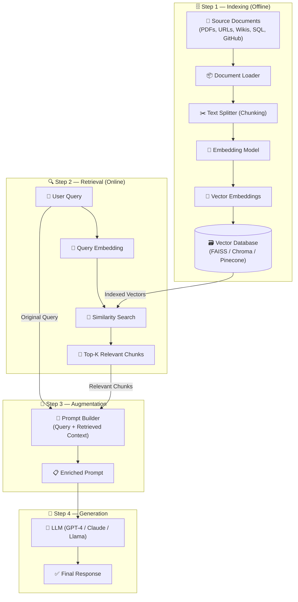

# 🧠 Data Ingestion Pipelines — Fine Tuning & Retrieval Augmented Generation (RAG)

> **Author:** Ashu Mishra  
> **Role:** Technical Product Manager  
> **LinkedIn:** [linkedin.com/in/ashumish](https://www.linkedin.com/in/ashumish/)  
> **GitHub:** [github.com/ashumishra2104](https://github.com/ashumishra2104)  

---

## 📌 About This Repository

This repository contains my personal course notes, diagrams, and intellectual property derived from my presentation on **Data Ingestion Pipelines, Fine Tuning, and Retrieval Augmented Generation (RAG)**.

All content here is authored by **Ashu Mishra** and represents original educational material developed for teaching AI Product Management.

> © 2025 Ashu Mishra. All rights reserved. Unauthorized reproduction or distribution without express written consent is prohibited.

---

## 📂 Repository Structure

```
RAG_and_FineTuning/
│
├── README.md                          # This file
├── .gitignore                         # Git ignore rules
├── LICENSE                            # IP & Copyright notice
└── data-ingestion-pipelines-rag.md    # Full course notes with Mermaid diagram
```

---

## 📖 What's Inside

### `data-ingestion-pipelines-rag.md`
A comprehensive markdown document covering:

| Section | Topics |
|---|---|
| **LLM Fundamentals** | How Transformers work, the three problems of LLMs |
| **Fine Tuning** | SFT, Few-Shot, Transfer Learning, Domain-Specific, RLHF, RLAIF, Instruction Tuning, PEFT/LoRA |
| **Emergent Properties** | In-context learning as an emergent behaviour of scale |
| **In-Context Learning** | Applications: Sentiment Analysis, NER |
| **RAG Definition** | What RAG is and why it exists |
| **RAG Architecture** | Indexing → Retrieval → Augmentation → Generation |
| **Mermaid Diagram** | Full RAG pipeline diagram rendered natively on GitHub |

---

## 🧩 RAG Architecture Overview



---

## 🔗 References & Further Reading

- [RAG Original Paper — arxiv.org/pdf/2312.10997](https://arxiv.org/pdf/2312.10997)
- [RLHF — HuggingFace Blog](https://huggingface.co/blog/rlhf)
- [PEFT Methods — HuggingFace Blog](https://huggingface.co/blog/samuellimabraz/peft-methods)
- [In-Context Learning — Stanford AI Blog](https://ai.stanford.edu/blog/understanding-incontext/)
- [Fine Tuning Survey — arxiv.org/html/2408.13296v1](https://arxiv.org/html/2408.13296v1)
- [GPT-3 Few-Shot Paper — arxiv.org/pdf/2005.14165](https://arxiv.org/pdf/2005.14165)
- [Live Demo: Movie Genre Predictor](https://huggingface.co/spaces/Ashumishra94/Movie_genre_predictor)

---

## 🛡️ License & Intellectual Property

```
© 2025 Ashu Mishra. All Rights Reserved.

This repository and all its contents — including text, diagrams, and educational material —
are the intellectual property of Ashu Mishra.

You may NOT:
  - Reproduce or redistribute this content without written permission
  - Use this content commercially without consent
  - Claim authorship of any material in this repository

You MAY:
  - Reference this work with proper attribution
  - Fork this repo for personal learning (non-commercial)
  - Share the repository link with attribution
```

---

## 🤝 Connect

- 🔗 **LinkedIn:** [linkedin.com/in/ashumish](https://www.linkedin.com/in/ashumish/)
- 💻 **GitHub:** [github.com/ashumishra2104](https://github.com/ashumishra2104)
- 🤗 **HuggingFace:** [huggingface.co/Ashumishra94](https://huggingface.co/Ashumishra94)

---

*Made with ❤️ by Ashu Mishra — Technical Product Manager & AI Educator*
