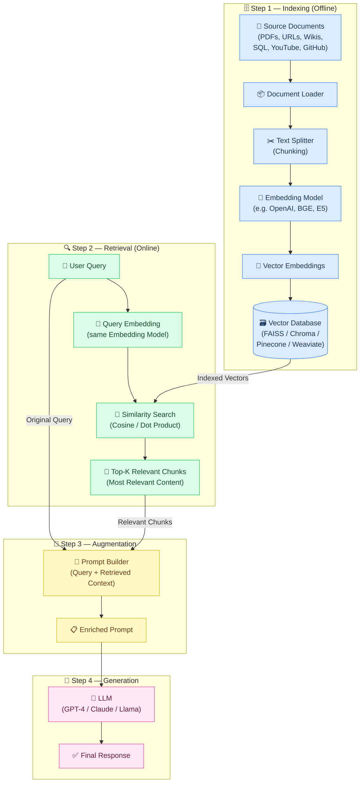

# Data Ingestion Pipelines — Fine Tuning & Retrieval Augmented Generation (RAG)

> **Author:** Ashu Mishra  
> **Role:** Technical Product Manager  
> **LinkedIn:** [linkedin.com/in/ashumish](https://www.linkedin.com/in/ashumish/)  
> **© 2025 Ashu Mishra. All rights reserved.**  
> *This document is the intellectual property of Ashu Mishra. Unauthorized reproduction, distribution, or modification is prohibited without express written consent.*

---

## Table of Contents

1. [Agenda](#agenda)
2. [How Transformers / LLMs Work](#how-transformers--llms-work)
3. [The Three Problems of LLMs](#the-three-problems-of-llms)
4. [Solution 1: Fine Tuning](#solution-1-fine-tuning)
   - [What is Fine Tuning?](#what-is-fine-tuning)
   - [Analogy: Ramesh the PM at Apple](#analogy-ramesh-the-pm-at-apple)
   - [Types of Fine Tuning](#types-of-fine-tuning)
   - [Process of Fine Tuning](#process-of-fine-tuning)
   - [How Fine Tuning Solves the Three Problems](#how-fine-tuning-solves-the-three-problems)
   - [Problems with Fine Tuning](#problems-with-fine-tuning)
5. [Emergent Properties of LLMs](#emergent-properties-of-llms)
6. [In-Context Learning](#in-context-learning)
   - [Applications](#applications)
   - [Enhancement Beyond In-Context Learning](#enhancement-beyond-in-context-learning)
7. [Retrieval-Augmented Generation (RAG)](#retrieval-augmented-generation-rag)
   - [Definition](#definition)
   - [How RAG Works: The Four Steps](#how-rag-works-the-four-steps)
   - [Step 1: Indexing](#step-1-indexing)
   - [Step 2: Retrieval](#step-2-retrieval)
   - [Step 3: Augmentation](#step-3-augmentation)
   - [Step 4: Generation](#step-4-generation)
   - [Complete RAG Architecture](#complete-rag-architecture)
8. [RAG Mermaid Diagram](#rag-mermaid-diagram)

---

## Agenda

- LLM explained  
- Deficiencies in LLM  
- Fine tuning  
- In-context learning and emerging patterns of LLMs  
- What is Retrieval Augmented Generation (RAG)  
- How does RAG work and its components  
- Explanation of nodes in n8n  

---

## How Transformers / LLMs Work

Large Language Models (LLMs) are built on the Transformer architecture. They are trained on massive corpora of text data and learn to predict the next token in a sequence — capturing syntax, semantics, world knowledge, and reasoning patterns through billions of parameters.

---

## The Three Problems of LLMs

> References:  
> - [HuggingFace Models](https://huggingface.co/models)  
> - [Hallucination Survey – ResearchGate](https://www.researchgate.net/publication/380634033_Unveiling_Hallucination_in_Text_Image_Video_and_Audio_Foundation_Models_A_Comprehensive_Survey)

1. **Lack of ownership in personal/private data** — LLMs are trained on public data and have no knowledge of your organisation's internal or proprietary information.
2. **No recent news** — Training data has a cutoff date; LLMs cannot access information about events after that cutoff.
3. **Hallucinations** — LLMs sometimes generate plausible-sounding but factually incorrect information.

---

## Solution 1: Fine Tuning

### What is Fine Tuning?

> Reference: [arxiv.org/html/2408.13296v1](https://arxiv.org/html/2408.13296v1)

Fine-tuning is the process of taking a pre-trained model and further training it on a domain-specific dataset.

- Fine-tuning models is a crucial step for improving the model's ability to perform specific tasks — such as sentiment analysis, question answering, or document summarisation — with higher accuracy.
- Fine-tuning tailors the model to have better performance for specific tasks, making it more effective and versatile in real-world applications.
- This process is essential for adapting an existing model to a particular task or domain.

> **Live Demo:** [Ashu's Movie Genre Predictor on HuggingFace Spaces](https://huggingface.co/spaces/Ashumishra94/Movie_genre_predictor)

---

### Analogy: Ramesh the PM at Apple

- **Step 1:** Ramesh, an MBA grad, got selected as a Product Manager for Apple, Cupertino.
- **Step 2:** He received training specific to working inside the Apple organisation.

Just as Ramesh needed domain-specific training on Apple's internal processes — beyond his general MBA education — an LLM needs fine-tuning on domain-specific data to perform well in specialised contexts.

---

### Types of Fine Tuning

#### 1. Supervised Fine Tuning (SFT)
> Reference: [Google Cloud Blog – Supervised Fine Tuning for Gemini LLM](https://cloud.google.com/blog/products/ai-machine-learning/supervised-fine-tuning-for-gemini-llm)

The most straightforward and common fine-tuning approach. The model is trained on a **labelled dataset** specific to the target task — such as text classification or named entity recognition.

*Example:* For sentiment analysis, train on text samples labelled with their corresponding sentiment.

#### 2. Few-Shot Learning
> Reference: [arxiv.org/pdf/2203.04291](https://arxiv.org/pdf/2203.04291)

When collecting a large labelled dataset is impractical. Few-shot learning provides a **few examples (shots)** of the required task at the beginning of the input prompts, helping the model gain better context without extensive fine-tuning.

#### 3. Transfer Learning
> References: [arxiv.org/pdf/2501.06863](https://arxiv.org/pdf/2501.06863), [arxiv.org/pdf/2402.15061](https://arxiv.org/pdf/2402.15061)

While all fine-tuning is a form of transfer learning, this category specifically enables a model to **perform a task different from what it was initially trained on** — leveraging knowledge from a large, general dataset and applying it to a more specific or related task.

#### 4. Domain-Specific Fine Tuning

Adapts the model to understand and generate text specific to a **particular domain or industry**.

*Example:* To build a chatbot for a medical app, the model is fine-tuned on medical records to adapt its language understanding to the health domain.

#### 5. Reinforcement Learning from Human Feedback (RLHF)
> Reference: [HuggingFace Blog – RLHF](https://huggingface.co/blog/rlhf)

**Process:**
1. **Human Preference Collection:** Human evaluators compare multiple model outputs for the same prompt and indicate which response is better.
2. **Reward Model Training:** A separate reward model is trained to predict human preferences based on this feedback data.
3. **Policy Optimisation:** The main LLM is fine-tuned using reinforcement learning (typically PPO — Proximal Policy Optimisation) to maximise the reward score.
4. **Iterative Process:** The model generates responses, receives rewards, and updates its parameters to produce more preferred outputs.

**Industry Applications:** Customer Service Chatbots · AI Code Assistants · Conversational AI Assistants

#### 6. Instruction Tuning
> Reference: [arxiv.org/html/2308.10792v5](https://arxiv.org/html/2308.10792v5)

The model is fine-tuned on a diverse set of tasks **formatted as instructions** (e.g., *"Translate this to French"*, *"Summarise this article"*). This helps the model follow instructions better and generalise across different tasks. It is often the step before RLHF.

#### 7. RLAIF — Reinforcement Learning from AI Feedback
> Reference: [arxiv.org/pdf/2402.12366](https://arxiv.org/pdf/2402.12366)

An alternative to RLHF where **AI models provide the feedback** instead of human evaluators. A more powerful AI judges and ranks the outputs of the model being trained. Designed to scale alignment training without the high cost and time of human feedback.

#### 8. Parameter-Efficient Fine Tuning (PEFT)
> References: [arxiv.org/pdf/2303.15647](https://arxiv.org/pdf/2303.15647), [HuggingFace Blog – PEFT Methods](https://huggingface.co/blog/samuellimabraz/peft-methods)

These methods fine-tune only a **small subset of parameters** rather than the entire model:

- **LoRA (Low-Rank Adaptation):** Adds small trainable matrices to the model while keeping the original weights frozen.
- **QLoRA:** Quantised version of LoRA for even more efficiency.
- **Prefix Tuning:** Adds trainable prefix vectors to each layer.
- **Adapter Layers:** Inserts small trainable modules between frozen layers.

---

### Process of Fine Tuning

The general process involves:
1. Start with a pre-trained base LLM.
2. Prepare a domain-specific labelled dataset.
3. Select the fine-tuning approach (SFT, PEFT/LoRA, RLHF, etc.).
4. Train the model on the new dataset with a smaller learning rate.
5. Evaluate and iterate.

---

### How Fine Tuning Solves the Three Problems

| Problem | How Fine Tuning Helps |
|---|---|
| **Lack of personal/private data ownership** | Training the LLM on your private data makes that data part of its parametric knowledge. The model can now answer questions related to your private data. |
| **No recent news** | You can include recent data in your training dataset, updating the model's knowledge. |
| **Hallucinations** | You can add examples with tricky prompts where the LLM used to get confused. Train the model to say *"I don't know"* for tricky prompts instead of making up answers — explicitly training it to stick to facts only. |

---

### Problems with Fine Tuning

1. **Computationally expensive** — Requires significant GPU/TPU resources.
2. **Requires technical expertise** — Needs ML engineers familiar with training pipelines.
3. **Frequent retraining needed for updates** — Every time your data changes, you need to retrain.

---

## Emergent Properties of LLMs

> Reference: [arxiv.org/pdf/2005.14165](https://arxiv.org/pdf/2005.14165)

**What is an Emergent Property?**  
A behaviour or ability that suddenly appears when a system reaches a certain scale and complexity — even though it was not explicitly programmed.

**In-Context Learning as an Emergent Property:**  
When LLMs were being trained, developers did **not** plan for in-context learning. But as models grew bigger, this feature automatically appeared.

**Timeline:**
- **GPT-1 and GPT-2:** Did NOT show in-context learning. If you gave them examples in prompts, there was no guarantee they would learn from those examples.
- **GPT-3 (~175 billion parameters):** It was observed that GPT-3 **CAN** learn from examples given in the prompt and solve tasks. This led to the landmark paper: *"Language Models are Few-Shot Learners."*

---

## In-Context Learning

> References:  
> - [Stanford AI Blog – Understanding In-Context Learning](https://ai.stanford.edu/blog/understanding-incontext/)  
> - [arxiv.org/pdf/2305.16938](https://arxiv.org/pdf/2305.16938)  
> - [arxiv.org/pdf/2402.07927](https://arxiv.org/pdf/2402.07927)

**Definition:** The model learns to solve a task purely by seeing examples in the prompt — **without updating its weights.**

---

### Applications

- **Sentiment Analysis** — Provide a few labelled examples in the prompt; the model classifies new inputs correctly.
- **Named Entity Recognition (NER)** — Show examples of entity tagging; the model generalises.

---

### Enhancement Beyond In-Context Learning

| Approach | Description |
|---|---|
| **Traditional In-Context Learning** | Give examples in the prompt to teach the model *how* to solve a task. |
| **RAG Enhancement** | Instead of giving examples on HOW to solve a task, send the **entire context** needed to solve the query. |

---

## Retrieval-Augmented Generation (RAG)

### Definition

**RAG (Retrieval-Augmented Generation)** is an AI framework that combines the strengths of traditional information retrieval systems (such as search and databases) with the capabilities of generative LLMs.

> By combining your data and world knowledge with LLM language skills, grounded generation is more accurate, up-to-date, and relevant to your specific needs.

**Formula:**
```
RAG = Information Retrieval + Text Generation
```

- **Step 1:** Retrieve the text from source
- **Step 2:** Generate text based on the retrieved source

---

### How RAG Works: The Four Steps

> Reference: [arxiv.org/pdf/2312.10997](https://arxiv.org/pdf/2312.10997)

| Step | Name | Description |
|---|---|---|
| 1 | **Indexing** | Sourcing the data from websites, PDFs, etc. into a database |
| 2 | **Retrieval** | Finding which part of the data is most relevant to the query |
| 3 | **Augmentation** | Augmenting the query and data along with the parametric knowledge of LLM |
| 4 | **Generation** | Generation of final text by LLM upon analysis |

---

### Step 1: Indexing

Indexing is the process of preparing your knowledge base so it can be efficiently searched at query time. It consists of 4 sub-steps:

#### Sub-step 1: Document Ingestion
Load your source knowledge into memory.

**Examples of supported sources:**
- PDF reports, Word documents
- YouTube transcripts, blog pages
- GitHub repos, internal wikis
- SQL records, scraped webpages

**Component:** `Document Loader`

#### Sub-step 2: Text Chunking
Break large documents into small, semantically meaningful chunks.

**Why chunk?**
- LLMs have context limits (e.g., 4K–32K tokens)
- Smaller chunks are more focused → better semantic search

**Components:** `Document Loader → Text Splitter`

#### Sub-step 3: Embedding Generation
Convert each chunk into a dense vector (embedding) that captures its meaning.

**Why embeddings?**
- Similar ideas land close together in vector space
- Allows fast, fuzzy semantic search

**Components:** `Document Loader → Text Splitter → Embedding Model → Embeddings`

#### Sub-step 4: Storage in a Vector Store
Store the vectors along with the original chunk text and metadata in a vector database.

**Vector DB options:**
- **Local:** FAISS, Chroma
- **Cloud:** Pinecone, Weaviate, Milvus, Qdrant

**Components:** `Document Loader → Text Splitter → Embedding Model → Embeddings → Vector Database`

---

### Step 2: Retrieval

Retrieval is the real-time process of finding the most relevant pieces of information from a pre-built index based on the user's question.

> *"From all the knowledge I have, which 3–5 chunks are most helpful to answer this query?"*

**Sub-steps:**
1. Query Embedding — the user's query is converted to a vector.
2. Embedding matched with stored vectors — similarity search in the vector DB.
3. Ranking of results — chunks ranked by similarity score.
4. Most relevant content returned — top-k chunks selected.

**Components:** `Vector Database → Retriever → Query → Similarity Search → Most Relevant Content`

---

### Step 3: Augmentation

Augmentation refers to the step where the retrieved documents (chunks of relevant context) are **combined with the user's query** to form a new, enriched prompt for the LLM.

**Components:**

```
Prompt = Query + Most Relevant Context
```

The structured prompt is then passed to the LLM.

---

### Step 4: Generation

Generation is the final step where a Large Language Model (LLM) uses the user's query and the retrieved & augmented context to **generate a response**.

**Components:** `Prompt → LLM → Response`

---

### Complete RAG Architecture

```
[Step 1: Indexing]
Document Loader → Text Splitter → Embedding Model → Embeddings → Vector Database

[Step 2: Retrieval]
User Query → Query Embedding → Similarity Search in Vector DB → Top-K Relevant Chunks

[Step 3: Augmentation]
Query + Top-K Chunks → Enriched Prompt

[Step 4: Generation]
Enriched Prompt → LLM → Final Response
```

---

## RAG Mermaid Diagram

The following Mermaid diagram represents the complete RAG pipeline as illustrated across slides 26–43.



---

## Summary

| Concept | Key Takeaway |
|---|---|
| **Fine Tuning** | Adapts a pre-trained LLM to specific tasks/domains by retraining on labelled data |
| **RLHF / RLAIF** | Aligns LLM behaviour with human (or AI) preferences via reward modelling |
| **PEFT / LoRA** | Efficient fine-tuning by training only a small subset of parameters |
| **In-Context Learning** | An emergent property — the model learns from examples in the prompt without weight updates |
| **RAG** | Combines information retrieval with LLM generation; ideal for private, up-to-date, grounded answers |
| **RAG vs Fine Tuning** | RAG is better for dynamic, recent, private data; Fine Tuning is better for task-specific style/behaviour |

---

*© 2025 Ashu Mishra. All rights reserved. This material is the intellectual property of Ashu Mishra and may not be reproduced without written permission.*
